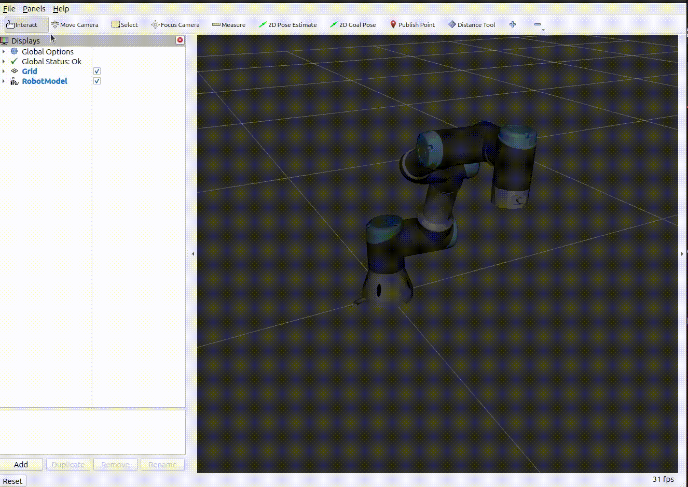

# Rviz2 Distance Tool

This package ports the [rviz_distance_tool](https://github.com/Jmeyer1292/rviz_distance_tool) from ROS1 to ROS2.

It's just the Rviz "measure tool" but with visualizations for the X, Y, and Z component of the selected vector.

